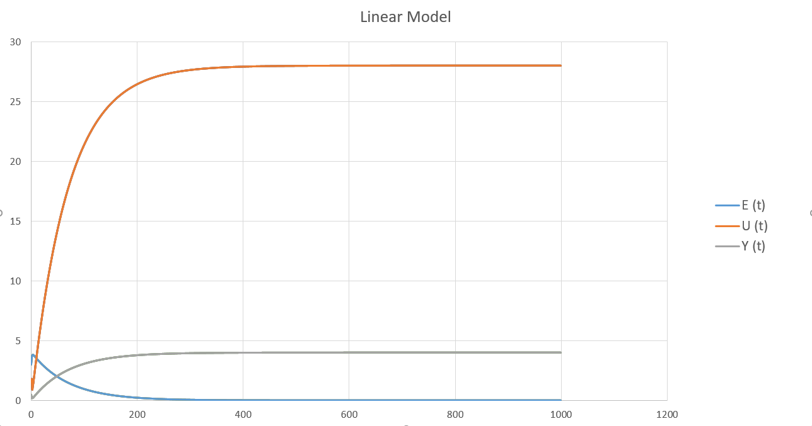
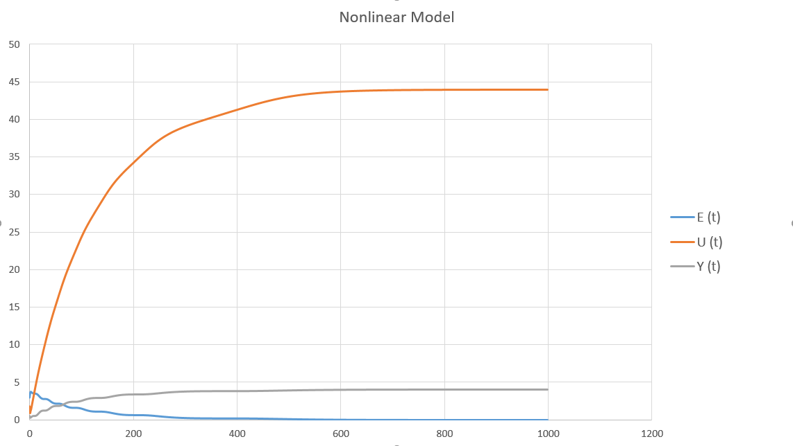

# <p align="center"> Министерство образования Республики Беларусь </p>

## <p align="center"> Учреждение образования «Брестский государственный технический университет»</p>

### <p align="center"> Кафедра ИИТ</p>


#### <p align="center">Лабораторная работа №2</p>

#### <p align="center">ПИД-регуляторы</p>

<p align="right" >Выполнил: </p>

<p align="right" >Студент 3 курса</p>

<p align="right" >Группы АС-55</p>

<p align="right" >Марзан А.В.</p>

<p align="right" >Проверил:</p>

<p align="right" >Иванюк Д.С.</p>

#### <p align="center">Брест, 2021</p>

<p align="center">Цель работы: На C++ реализовать программу, моделирующую рассмотренный выше ПИД-регулятор. В качестве объекта управления использовать математическую модель, полученную в предыдущей работе. Использовать ООП, в программе должно быть не менее 3-х классов (+наследование). В отчете также привести графики для разных заданий температуры объекта, пояснить полученные результаты (отчет получать с помощью Doxygen в .md формате).</p>

<p align="center">Ход работы </p>

Код программы :
```c++
#include<iostream>
#include<math.h>
using namespace std;

class Model
{
public:
    virtual float expression(double heat, double y) = 0;
};

class Linear : public Model
{
private:
    float a, b;
public:
    Linear(const float a, const float b)
    {
        this->a = a;
        this->b = b;
    }

    float expression(double heat, double y) override
    {
        y = a * y + b * heat;
        return y;
    }
};

class Non_Linear : public Model
{
private:
    float a, b, c, d;
    double y_0 = 0, heat_0 = 0;
public:
    Non_Linear(float a, float b, float c, float d)
    {
        this->a = a;
        this->b = b;
        this->c = c;
        this->d = d;
    }

    float expression(double heat, double y) override
    {
        double y_1;
        y_1 = a * y - b * pow(y_0, 2) + c * heat + d * sin(heat_0);
        y_0 = y;
        heat_0 = heat;
        return y_1;
    }
};

class Controller
{
private:
    double heat = 0;
    double K, T, T_D, T_0;
public:
    Controller(const double K, const double T_0, const double T_D, const double T)
    {
        this->K = K;
        this->T_0 = T_0;
        this->T_D = T_D;
        this->T = T;
    }
    double Heat(const double e, const double e_0 = 0, const double e_01 = 0)
    {
        double q_0, q_1, q_2;
        q_0 = K * (1.0 + T_D / T_0);
        q_1 = -K * (1 + 2.0 * T_D / T_0 - T_0 / T);
        q_2 = K * T_D / T_0;
        heat += q_0 * e + q_1 * e_0 + q_2 * e_01;
        return heat;
    }
};

void PID_System(const double w, Controller* ins, Model* m, double y)
{
    double e, e_0, e_01, u;
    e = 0.0,
        e_0 = 0.0,
        e_01 = 0.0;
    u = 0;
    for (int k = 0; k < 50; k++)
    {
        cout << e << "\t\t" << y << "\t\t" << u << endl;
        e = w - y;
        u = ins->Heat(e, e_0, e_01);
        y = m->expression(u, y);
        e_01 = e_0;
        e_0 = e;
    }
}

int main()
{
    cout << "Linear:\nE\t\tY\t\tU\n";
    cout << "------------------" << endl;

    Linear* m = new Linear(0.3, 0.1);
    Controller* r = new Controller(0.1, 10, 50, 10);
    PID_System(25, r, m, 0);

    cout << "\n\nNon_Linear:\nE\t\tY\t\tU\n";
    cout << "------------------" << endl;

    Non_Linear* nl = new Non_Linear(0.3, 0.1, 0.1, 0.1);
    Controller* nlr = new Controller(0.1, 10, 50, 10);
    PID_System(25, nlr, nl, 0);
    return 0;
}
}
```
Результаты: 


**Linear model**<br>



**Non-linear model**<br>



**Вывод:** 

 В ходе лабораторной работы я создал программу на языке C ++, имитирующую работу ПИД-регулятора.
