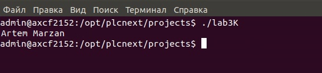

# <p align="center"> Министерство образования Республики Беларусь </p>

## <p align="center"> Учреждение образования «Брестский государственный технический университет»</p>

### <p align="center"> Кафедра ИИТ</p>


#### <p align="center">Лабораторная работа №3</p>

#### <p align="center">Работа с контроллером AXC F 2152</p>

<p align="right" >Выполнил: </p>

<p align="right" >Студент 3 курса</p>

<p align="right" >Группы АС-55</p>

<p align="right" >Марзан А.В.</p>

<p align="right" >Проверил:</p>

<p align="right" >Иванюк Д.С.</p>

#### <p align="center">Брест, 2021</p>

## Работа с контроллером AXC F 2152
1. Изучить руководство и согласно ему подготовить образ Ubuntu 18.04 LTS.
2. В среде Eclipse создать тестовый проект "Hello world!", собрать его и продемонстрировать работоспособность на тестовом контроллере.
  ## Code:
  ```C++
//============================================================================
// Name        : lab3.cpp
// Author      : Marzan Artyom
// Version     :
// Copyright   : 
// Description : completed the task on laboratory work 3 Marzan Artyom
//============================================================================

#include <iostream>
using namespace std;

int main() {
	cout << "Hello World!" << endl; // prints Hello World!
	return 0;
}

```
  ## Выполнение на тестовом контроллере:
  
  
